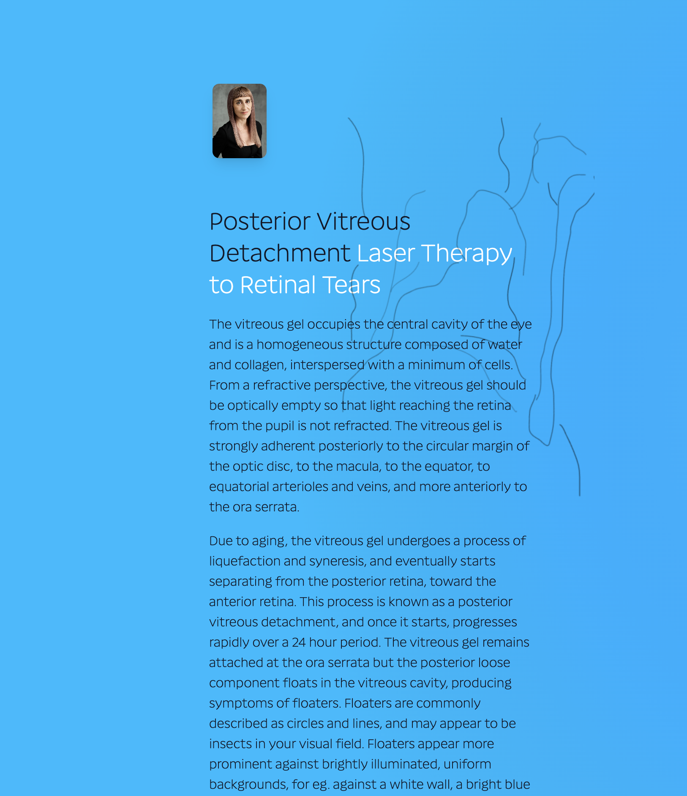
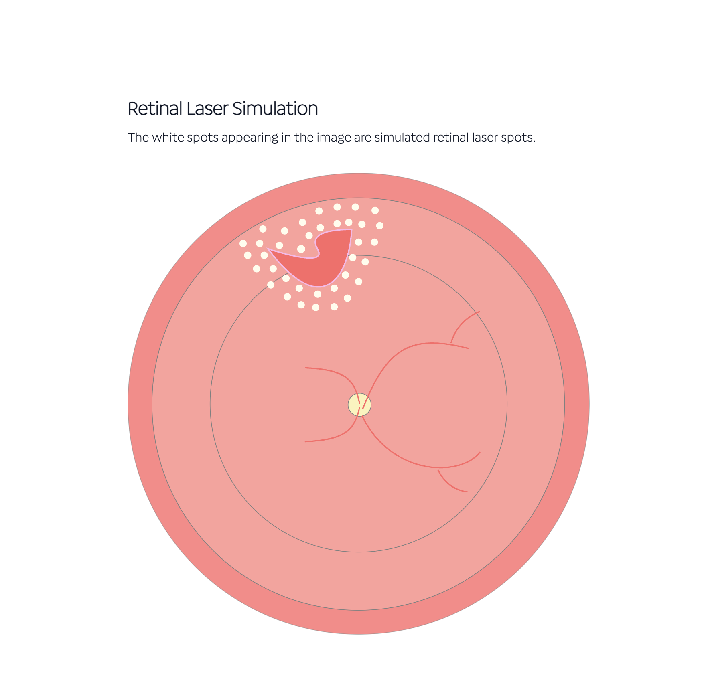
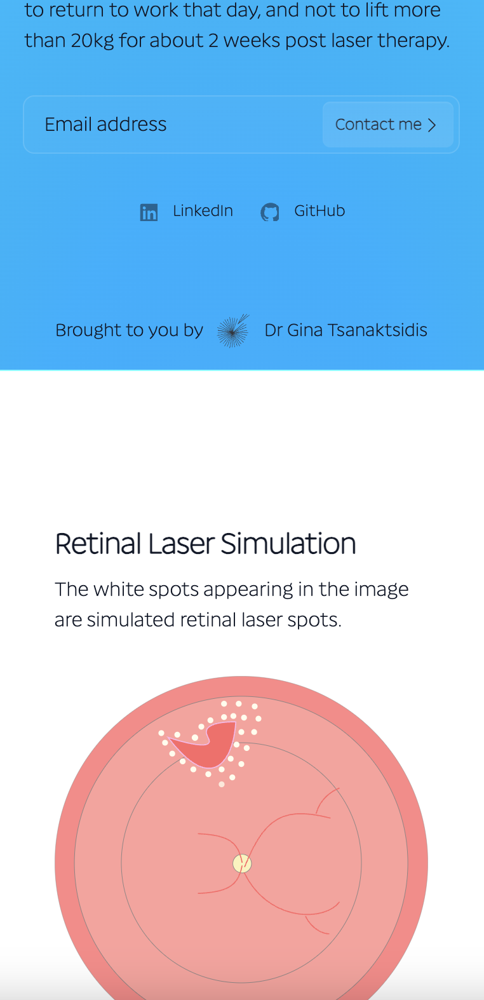

# retinal-laser

## Table of Contents

- [Description](#description)
- [Technologies Used](#technologies-used)
- [Features](#features)
- [Installation](#installation)
- [Usage](#usage)
- [License](#license)
- [Contributing Guidelines](#contributing-guidelines)
- [Testing](#testing)
- [Authors and Acknowledgements](#authors-and-acknowledgements)
- [Questions](#questions)

## Description

A responsive, full stack MERN app that educates users about posterior vitreous detachment, a common age-related eye condition where the vitreous gel separates from the retina. The app simulates the visual experience of floaters and demonstrates how laser therapy is used to treat associated retinal tears, preventing potential retinal detachment and visual loss.

Developed with medical accuracy by an ophthalmologist, this educational tool helps patients understand their condition and the treatment process through interactive visualizations.

## Technologies Used

- Frontend: Vite, React, TypeScript, GSAP, Tailwind CSS
- Backend: Node.js, Express.js
- Deployment: Render

## Features

- Interactive retinal tear visualization with anatomically correct structures
- Realistic floater field simulation 
- Animated laser therapy simulation
- Responsive design optimized for both desktop and mobile viewing
- Contact form for professional inquiries
- Smooth scroll-triggered animations that enhance user engagement

## Installation

To get started with this project, implement the following steps:

1. Clone the project:

```zsh
git clone git@github.com:gina-t/retinal-laser.git
```

2. Install `root` dependencies:

```zsh
npm install
```

3. Install `server` dependancies:

```zsh
cd server
npm install
```

4. Install `client` dependancies:

```zsh
cd client
npm install 
```

5. This project uses GSAP for animation. Register and login to GSAP and watch the tutorial for useGSAP()Hook. Import the useGSAP() hook from @gsap/react. useGSAP() is a drop-in replacement for useEffect() or useLayoutEffect() that automatically handles cleanup using gsap.context().

```zsh
npm install gsap @gsap/react
```

6. After installation, you can start the development server:

# Start server development 

```zsh
cd server
npm run dev
```

# Start client development 
```zsh
cd client
npm run dev
```


# Or run both concurrently

```zsh
npm run dev
```

7. Create separate .env.development and .env.production files in `server` directory:

```plaintext
PORT=
NODE_ENV=
LOG_LEVEL=
```

8. In `server` directory:

```zsh
npm run build
npm run start
```

## Usage

Link to deployed app url:

[retinal-laser](https://retinal-laser.onrender.com)

Screenshots of app demonstrating functionality:

### floater-field



### retinal-laser-sim



### scroll-triggered-animation




## License

[](https://opensource.org/licenses/MIT)


## Contributing Guidelines

To contribute, please follow these steps:

1. **Fork the Repository**:
   - Navigate to `https://github.com/gina-t/retinal-laser`
   - Click "Fork" to create a copy of the repository in your GitHub account.

2. **Clone the Forked Repository**:
   ```zsh
   git clone git@github.com:your-user-name/retinal-laser.git
   ```

3. **Create a Feature Branch**:
   - Create a new branch for your feature or bug fix:
     ```zsh
     git checkout -b feature/your-feature-name
     ```
4. **Make Changes**:
   - Make your changes to the codebase.
   - Ensure your changes follow the project's coding standards and guidelines.

5. **Commit Your Changes**:
   - Stage your changes:
     ```zsh
     git add -A
     ```
   - Commit your changes with a descriptive commit message:
     ```zsh
     git commit -m "Add your descriptive commit message here"
     ```

6. **Push Your Changes**:
   - Push your changes to your forked repository:
     ```zsh
     git push origin feature/your-feature-name
     ```

7. **Create a Pull Request**:
   - Navigate to the original repository.
   - Click the "New Pull Request" button.
   - Select your feature branch from your forked repository and compare it with the Develop branch of the original repository.
   - Click "Create Pull Request" to submit your changes for review.

8. **Review Process**:
   - Your pull request will be reviewed by the project maintainer.
   - Once your pull request is approved, it will be merged into the `develop` branch.

Thank you for contributing to the project.

## Testing

Component testing can be performed using Cypress.

To install and run tests:

```zsh
npm install --save-dev cypress
npx cypress open
```

## Authors and Acknowledgements

- **Dr. Gina Tsanaktsidis** - Full Stack Developer and Ophthalmologist
- Email: [ginadrcoder@gmail.com](mailto:ginadrcoder@gmail.com)


## Questions

For enquiries, please contact me at:

- Email: [ginadrcoder@gmail.com](mailto:ginadrcoder@gmail.com)

- GitHub: [gina-t](https://github.com/gina-t)
